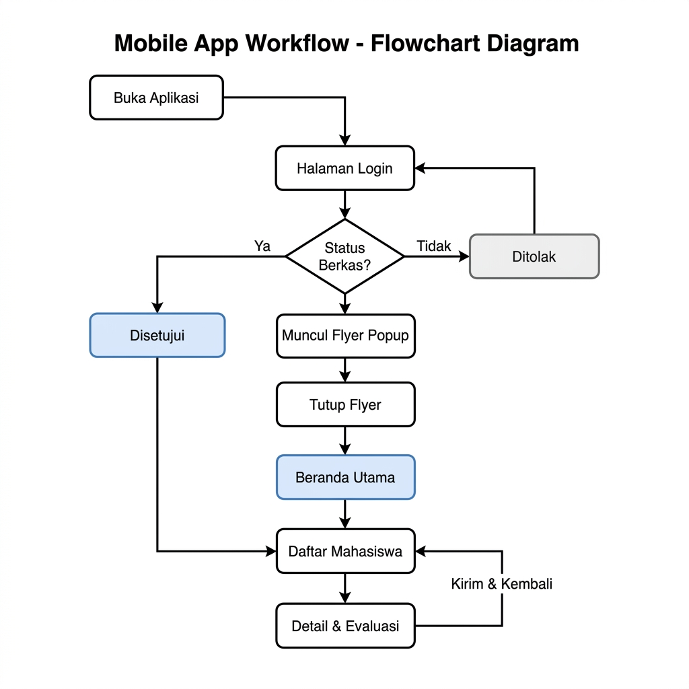

JAWABAN ANALISIS PROYEK FLUTTER (SIPTATIF)

SOAL 1: ANALISIS STRUKTUR FOLDER PROYEK

A. Representasi Visual Struktur Folder Proyek
Berikut adalah peta struktur folder dan berkas utama dari proyek Flutter:

siptatif-flutter-app-master/
├── android/ (Konfigurasi native Android)
├── ios/     (Konfigurasi native iOS)
├── assets/  (File non-kode: gambar/flyer & ikon SVG)
│   ├── img/ (novy.jpeg, siptatif-banner-intro-page.jpg, dll)
│   └── svgs/ (beranda-icon.svg, dll)
├── fonts/   (Font kustom Montserrat)
├── lib/     (KODE UTAMA DART)
│   ├── datas/ (Data tiruan / mock data)
│   │   ├── models/ (Kelas model: mahasiswa.dart, user.dart, dll)
│   │   ├── mahasiswa_data.dart
│   │   └── user_data.dart
│   ├── dialogs/ (Widget dialog: preview_profile_pict.dart)
│   ├── screens/ (Widget halaman aplikasi)
│   │   ├── beranda_screen.dart
│   │   ├── login_screen.dart
│   │   ├── mahasiswa_detail_screen.dart
│   │   └── tentang_aplikasi_screen.dart
│   └── main.dart (Titik masuk utama aplikasi)
└── pubspec.yaml (Konfigurasi dependensi dan aset)

B. Fungsi Folder dan Berkas Utama
1. lib/: Merupakan folder paling penting dalam proyek Flutter. Semua kode pemrograman Dart (logika, state management, UI widget) ditulis di dalam folder ini.
2. assets/: Digunakan untuk menyimpan aset statis non-kode seperti gambar banner (siptatif-banner-intro-page.jpg), flyer informasi, dan berkas SVG ikon navigasi.
3. pubspec.yaml: File konfigurasi utama proyek. Di sini didefinisikan versi Flutter SDK, dependensi eksternal (seperti google_fonts, flutter_svg), serta deklarasi jalur (path) aset gambar dan font agar bisa digunakan di kode Dart.
4. main.dart: Titik masuk (entry point) dari seluruh aplikasi. Flutter memulai kompilasi dan menjalankan fungsi main() pertama kali dari file ini.
5. login_screen.dart (Halaman Login): Berfungsi untuk menampilkan antarmuka pengguna (UI) halaman login, menangani input username/email, kata sandi, serta menjembatani proses verifikasi sebelum pengguna masuk ke menu utama.

C. Hubungan Antar Komponen
- pubspec.yaml mendaftarkan pustaka eksternal dan mendeteksi folder assets/.
- Berkas main.dart membaca pustaka tersebut, memuat konfigurasi rute, dan menampilkan layar awal.
- Berkas-berkas layar di folder screens/ (seperti login_screen.dart) mengambil aset gambar dari assets/ dan menarik data statis yang terdefinisi di folder datas/ untuk ditampilkan ke layar pengguna.

--------------------------------------------------

SOAL 2: ANALISIS BERKAS MAIN.DART

A. Penjelasan Komponen Utama
- a. Fungsi method main(): Merupakan gerbang pertama saat aplikasi dijalankan oleh mesin Dart. Fungsi ini memanggil fungsi runApp() yang bertugas memasukkan widget akar (MainApp()) ke dalam pohon widget (widget tree) agar dirender oleh mesin Flutter.
- b. Fungsi widget MaterialApp: Berfungsi sebagai konfigurasi global aplikasi yang mengadopsi standar desain Material. Widget ini menyediakan fitur navigasi/rute halaman (routes), tema visual (theme), lokalisasi, serta penentuan halaman utama (home).
- c. Widget pertama yang ditampilkan: Widget MainScreen karena disetel pada properti home: const MainScreen().

B. Potongan Kode yang Relevan (main.dart)
void main(){
  runApp(MainApp()); // Memulai aplikasi dengan memanggil MainApp
}

class MainApp extends StatefulWidget {
  const MainApp({super.key});

  @override
  State<MainApp> createState() => _MainAppState();
}

class _MainAppState extends State<MainApp> {
  @override
  Widget build(BuildContext context) {
    return MaterialApp(
      routes: {
        "/login": (context) => const LoginScreen(),
        "/main": (context) => const MainScreen(),
        "/mhs-detail-screen": (context) => const MahasiswaDetailScreen(),
        // rute lainnya...
      },
      title: "SIPTATIF Mobile",
      debugShowCheckedModeBanner: false,
      theme: ThemeData(
        textTheme: GoogleFonts.montserratTextTheme(), // Mengatur font global
      ),
      home: const MainScreen(), // Halaman default pertama kali dimuat
    );
  }
}

C. Alur Eksekusi Aplikasi
1. Sistem operasi memanggil fungsi main() di main.dart.
2. Fungsi runApp(MainApp()) dijalankan untuk menginisialisasi aplikasi.
3. MainApp membangun widget MaterialApp yang menyiapkan tema visual, rute, dan setelan dasar aplikasi.
4. Flutter merender dan memuat halaman MainScreen secara otomatis (karena disetel di parameter home) sebagai antarmuka pertama yang dilihat pengguna.

--------------------------------------------------

SOAL 3: ANALISIS KOMPONEN HALAMAN LOGIN_SCREEN.DART

A. Fungsi Widget Utama
1. Scaffold: Menyediakan struktur visual dasar halaman (seperti latar belakang putih dan manajemen tumpang tindih keyboard).
2. SingleChildScrollView: Membungkus seluruh konten agar halaman bisa digulir secara vertikal jika layar perangkat berukuran kecil atau ketika keyboard muncul agar tidak terjadi pixel overflow (layar terpotong).
3. Column: Menyusun widget anak (gambar, teks, form input, tombol) secara berurutan dari atas ke bawah.
4. TextField: Digunakan untuk menerima input teks dari pengguna berupa Email/Username dan Password.
5. TextButton: Digunakan sebagai tombol tindakan utama ("LOGIN") yang memicu navigasi.
6. InkWell: Menyediakan area interaksi sentuh dengan efek riak air (splash effect) pada teks biasa (seperti link "Lupa Password?" dan "Daftar Disini").

B. Hubungan Antar Widget
Scaffold bertindak sebagai fondasi terluar. Di dalamnya, SingleChildScrollView menjadi wadah dinamis yang membungkus Column. Di dalam Column, widget visual seperti Image.asset (Logo SIPTATIF) diletakkan di paling atas, diikuti oleh teks judul, lalu susunan TextField untuk form input, tombol aksi TextButton, dan diakhiri dengan teks navigasi alternatif menggunakan Row and InkWell.

C. Interaksi Pengguna
- Pengguna mengetuk TextField -> Keyboard ponsel muncul, pengguna mengetik kredensial login.
- Pengguna mengetuk ikon mata di dalam TextField password -> Memicu pembaruan status (setState()) yang membalik properti untuk menyembunyikan/menampilkan teks sandi.
- Pengguna mengetuk TextButton "LOGIN" -> Memicu fungsi navigasi (Navigator.pushReplacementNamed) untuk berpindah ke halaman utama.

--------------------------------------------------

SOAL 4: IDENTIFIKASI WIDGET INPUT

Untuk mempermudah penempatan gambar screenshot di Microsoft Word, berikut adalah rincian penjelasan dari tiga widget input yang digunakan beserta petunjuk peletakan screenshot-nya:

1. WIDGET INPUT: TextField / TextFormField
- Letak Berkas (Contoh): login_screen.dart atau tambah_pembimbing.dart
- Fungsi Utama: Menerima masukan teks bebas dari pengguna seperti teks pencarian, email, nama dosen, atau catatan.
- Cara Menerima Input: Pengguna mengetik menggunakan keyboard virtual. Nilai input dideteksi langsung melalui properti input atau kontroler teks.
[SEMATKAN SCREENSHOT WIDGET TEXTFIELD DI SINI]
(Petunjuk: Ambil screenshot form input Email/Password di Halaman Login atau form input Nama Dosen di halaman Tambah Pembimbing)

2. WIDGET INPUT: Checkbox
- Letak Berkas (Contoh): mahasiswa_detail_screen.dart
- Fungsi Utama: Memilih opsi biner (pilihan setuju/tidak, ya/tidak) atau status tertentu.
- Cara Menerima Input: Pengguna mengetuk kotak centang. Widget mendeteksi ketukan melalui parameter onChanged, lalu mengubah nilai status boolean (true atau false) dan memanggil setState() untuk memperbarui tampilan antarmuka secara langsung.
[SEMATKAN SCREENSHOT WIDGET CHECKBOX DI SINI]
(Petunjuk: Ambil screenshot bagian kotak centang Diterima / Ditolak pada halaman Detail Mahasiswa)

3. WIDGET INPUT: TextButton / FilledButton
- Letak Berkas (Contoh): main_screen.dart atau mahasiswa_detail_screen.dart
- Fungsi Utama: Menjadi tombol interaktif yang memicu aksi tertentu, mengirim data, atau melakukan navigasi.
- Cara Menerima Input: Pengguna mengetuk area tombol. Aksi sentuhan tersebut memicu callback pada parameter onPressed untuk mengeksekusi logika di dalamnya (seperti berpindah halaman atau mengirim formulir).
[SEMATKAN SCREENSHOT WIDGET BUTTON DI SINI]
(Petunjuk: Ambil screenshot tombol LOGIN hitam di Halaman Login atau tombol KIRIM hijau di halaman Detail Mahasiswa)

--------------------------------------------------

SOAL 5: ANALISIS INTEGRASI ANTAR KOMPONEN APLIKASI

A. Hubungan main.dart dengan Halaman Lain
main.dart mendefinisikan rute global aplikasi pada properti routes di dalam MaterialApp. Semua rute halaman di aplikasi (seperti /login, /register, /main, dll.) didaftarkan di sini agar sistem navigasi di halaman lainnya dapat memanggil halaman-halaman tersebut berdasarkan nama rutenya secara konsisten (misal: memanggil /main saat pengguna berhasil login).
[SEMATKAN SCREENSHOT KODE ROUTES DI MAIN.DART DI SINI]
(Petunjuk: Ambil screenshot kode bagian rute 'routes: {...}' pada file main.dart untuk membuktikan pendefinisian rute global)

B. Mekanisme Navigasi yang Digunakan
1. Named Routes (Rute Bernama): Menggunakan Navigator.pushNamed(), Navigator.pushReplacementNamed(), dan Navigator.pop() untuk perpindahan halaman penuh antar modul.
2. Navigasi Berbasis Indeks (Bottom Navigation Bar): Di dalam main_screen.dart, digunakan variabel status indeks untuk menentukan widget halaman mana (Beranda, Mahasiswa, Penguji, Pembimbing) yang akan ditampilkan. Memilih ikon di menu bawah tidak memicu transisi rute penuh, namun merender ulang area isi (body) berdasarkan indeks yang diubah melalui setState().
[SEMATKAN SCREENSHOT NAVIGATION BAR DI EMULATOR ATAU KODE NAVIGATOR DI SINI]
(Petunjuk: Ambil screenshot tampilan Bottom Navigation Bar di bagian bawah emulator, atau screenshot kode Navigator.pushReplacementNamed di login_screen.dart)

C. Cara Aplikasi Menerima dan Menampilkan Data
1. Menampilkan Data: Aplikasi menarik data tiruan (mock data) berbentuk list object dari folder lib/datas/ (seperti mahasiswa_data.dart). Pada halaman tampilan (misalnya di Daftar Mahasiswa), variabel daftar ini dipanggil lalu dilooping menggunakan fungsi .map() untuk diubah menjadi rentetan antarmuka kartu (Card) secara terstruktur.
2. Menerima Data: Aplikasi menerima input interaktif melalui UI (seperti teks di TextField atau centang Checkbox). Karena aplikasi ini berjalan statis tanpa koneksi server (backend/API) betulan, input yang diterima disalurkan pada status internal aplikasi dan akan hilang saat aplikasi di-restart ulang.
[SEMATKAN SCREENSHOT DAFTAR MAHASISWA / KARTU MAHASISWA DI EMULATOR DI SINI]
(Petunjuk: Ambil screenshot halaman Daftar Mahasiswa di emulator untuk menunjukkan data tiruan yang berhasil dimuat dan ditampilkan dalam bentuk kartu visual)

D. Alur Kerja Aplikasi (Workflow & Flowchart)
Berikut adalah penjelasan langkah-langkah alur kerja pengguna (workflow) dari awal membuka aplikasi hingga menyelesaikan evaluasi pada Halaman Detail Mahasiswa:

1. Membuka Aplikasi: Aplikasi SIPTATIF dijalankan oleh sistem operasi dan langsung memuat halaman utama.
2. Login Pengguna: Jika sesi habis, halaman login akan ditampilkan. Pengguna memasukkan kredensial (Email/Username dan Password) dan menekan tombol LOGIN.
3. Dialog Flyer Informasi: Setelah login berhasil, aplikasi mengalihkan rute ke halaman utama (MainScreen). Pada saat MainScreen pertama kali dimuat (melalui initState), sistem otomatis memunculkan dialog pop-up berisi gambar flyer_informasi.png. Pengguna harus menekan tombol Tutup untuk menutup dialog agar dapat berinteraksi dengan halaman utama.
4. Menu Beranda: Setelah dialog ditutup, tab Beranda ditampilkan secara default yang menyajikan statistik kuota dan jumlah pendaftar mahasiswa, penguji, dan pembimbing.
5. Navigasi ke Menu Mahasiswa: Pengguna mengetuk tab navigasi Mahasiswa di bagian menu navigasi bawah (Bottom Navigation Bar).
6. Daftar Mahasiswa: Halaman body memuat daftar mahasiswa yang telah mengajukan berkas secara dinamis dari database/data tiruan.
7. Membuka Detail Mahasiswa: Pengguna mencari mahasiswa yang diinginkan dan mengetuk ikon Edit/Detail pada salah satu baris data kartu mahasiswa.
8. Form Evaluasi & Penguji: Halaman detail berkas mahasiswa dimuat. Pada tab kedua (Input Dosen Penguji), admin/dosen dapat mengisi input nama Dosen Penguji 1 dan Dosen Penguji 2 melalui TextField.
9. Persetujuan Status Berkas: Pengguna mengevaluasi berkas mahasiswa dengan menandai kotak centang (Checkbox) status berkas: Diterima atau Ditolak.
10. Kirim Evaluasi: Pengguna menekan tombol KIRIM. Aplikasi memproses penyimpanan data evaluasi secara lokal dan mengeksekusi perintah Navigator.pop(context) untuk menutup halaman detail dan mengembalikan pengguna ke halaman daftar mahasiswa sebelumnya.

Berikut adalah diagram alir (flowchart) visual dari alur kerja di atas:
[SEMATKAN GAMBAR FLOWCHART_ALUR_KERJA.PNG DI SINI]
(Petunjuk: Masukkan/sisipkan file gambar 'flowchart_alur_kerja.png' yang berada di folder assets/img/ ke bagian ini di Microsoft Word Anda)

